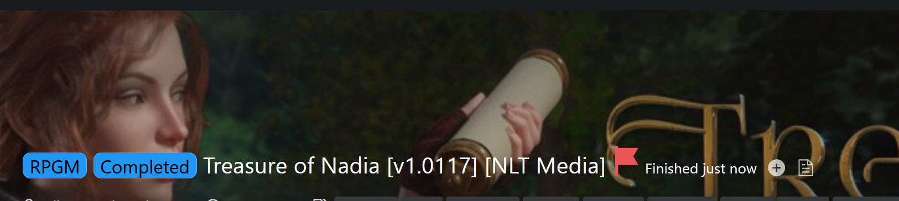
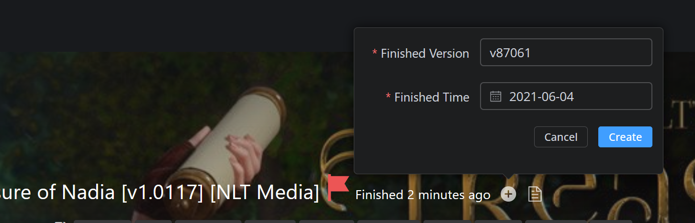
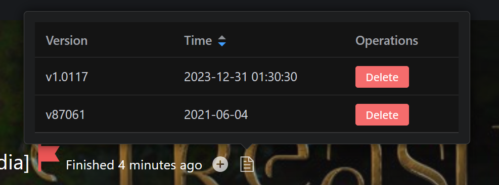

# FZ Tracker

> ### "Which version of the game did I play last time? I forgot again! Damn!"🤦

**FZ Tracker** helps you to track game versions you finished playing on F95Zone. 
No desktop software needed, everything can be done right in the game page.

Life is short. Use **FZ Tracker**.
___

## Features

### 1. One-click to record the current version

### 2. Manually add a record

### 3. Manage records

## Installation

1. Install [Tampermonkey](https://www.tampermonkey.net/) for your browser
2. Install the script from [GreasyFork](https://greasyfork.org/en/scripts/483174-fz-tracker)

## Usage

1. Open any game page on F95Zone.
2. Happy tracking (or f@pping✊🍌💦) ! 🤣

## Changelog

### 1.1.0 (2023-12-31)
- UI improvements
- Support manually adding a record
- Support managing records

### 1.0.0 (2023-12-27)
- Initial release